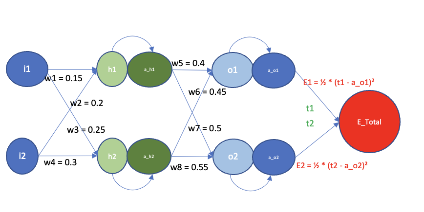
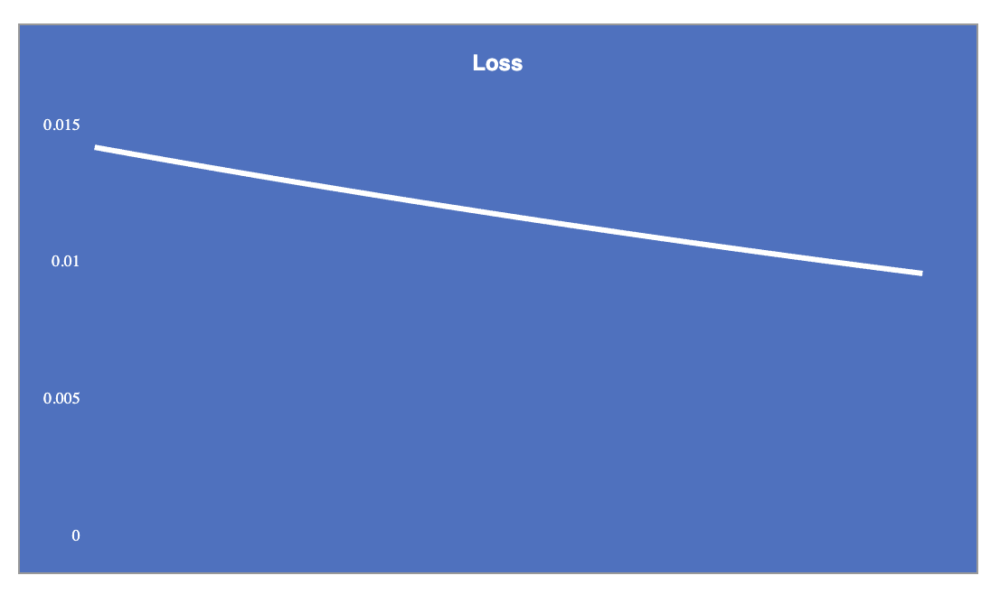
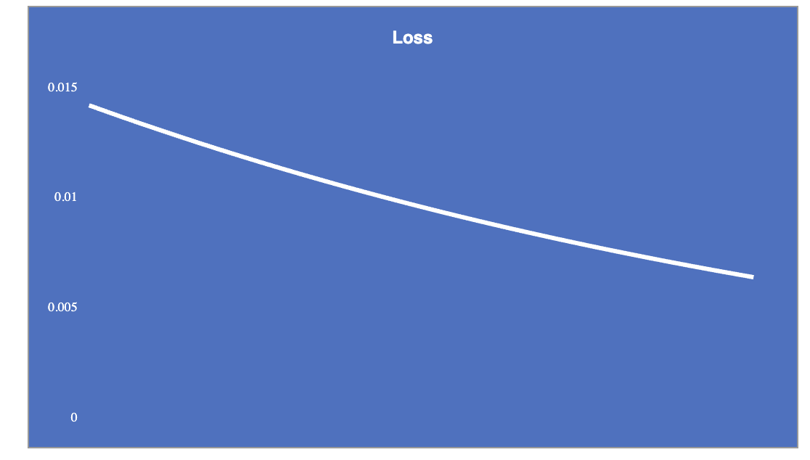
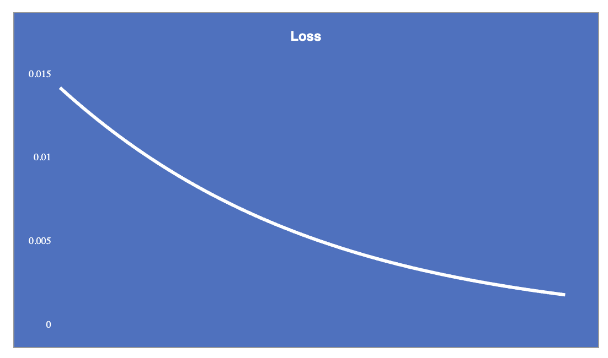
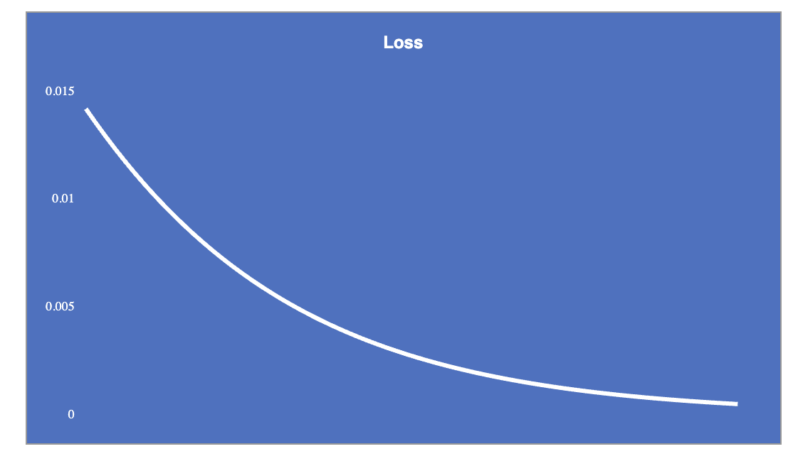
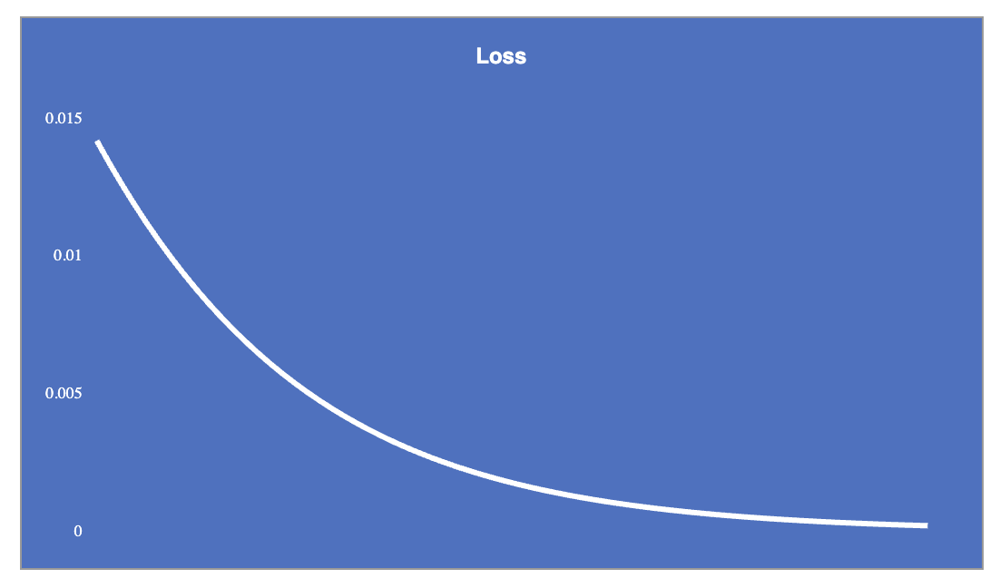
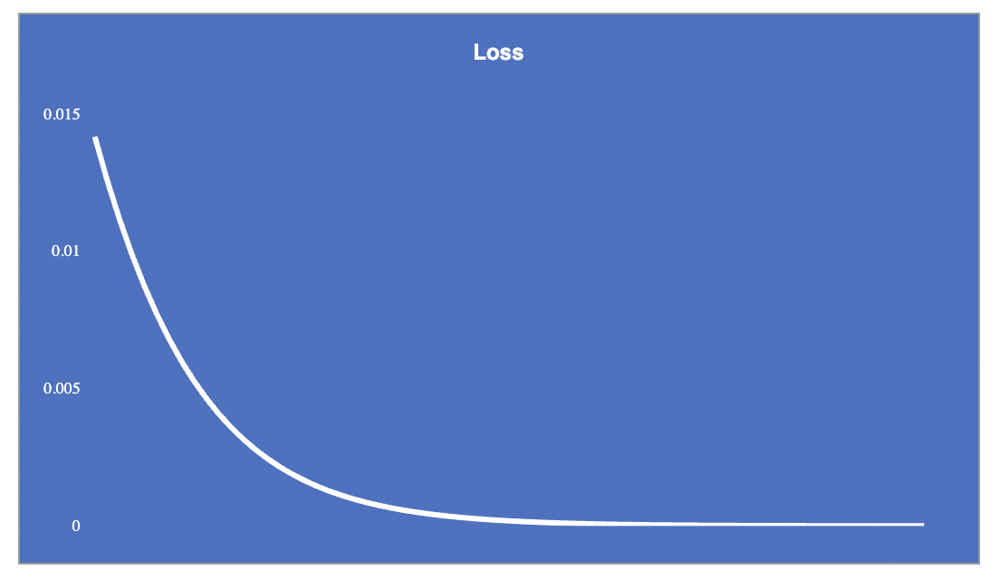

<!-- markdownlint-disable MD030 -->

# ERA Session 6 Assignment - Mayukh

<a href="https://theschoolof.ai/#programs">Learn about the program here</a>

## 📝 Overview

### Exercise on back propagation

This document outlines a step-by-step procedure for manually computing weight gradients of an example fully connected layer and propagating them. This exercise aims to gain a deeper appreciation and understanding of the inner workings of PyTorch's backpropagation process.

Understanding backpropagation is crucial in the field of neural networks as it enables the efficient training of deep learning models. By iteratively adjusting the network's weights based on the gradients of the loss function, backpropagation allows the model to learn and improve its predictions. This process plays a vital role in unlocking the potential of neural networks, enabling them to solve complex problems across various domains, including image recognition, natural language processing, and more.

### Step by Step Description

-   

-   `Summary of the FCL`

    The FCL in question has 2 inputs (input layer), hidden layer and 2 outputs (output layer).

    `Terminology`:

    `i1, i2` - inputs

    `w1, w2, w3, w4, w5, w6, w7, w8` - weights

    `h1, h2` - neurons containing values of inputs multiplied with weights

    `a_h1, a_h2` - obtained by applying sigmoid function (activation) on h1 and h2

    `o1, o2` - neurons containing values of h1 and h2 multiplied with weights

    `a_o1, a_o2` - obtained by applying sigmoid function (activation) on o1 and o2

    `t1, t2` - target outputs

    `E1, E2` - Loss (calculated by custom defined functions)

    `E_Total` - Total Loss (E1+E2)
    
    `Basic Calculations in the FCL`:

    ```
    h1 = w1*i1 + w2*i2		
    h2 = w3*i1 + w4*i2		
    a_h1 = σ(h1) = 1/(1 + exp(-h1))		
    a_h2 = σ(h2)		
    o1 = w5*a_h1 + w6*a_h2		
    o2 = w7*a_h1 + w8*a_h2		
    a_o1 = σ(o1)		
    a_o2 = σ(o2)		
    E_total = E1 + E2		
    E1 = ½ * (t1 - a_o1)²		
    E2 = ½ * (t2 - a_o2)²		
    ```
    
-   `Evaluating Partial Derivates`

    Now we wish to calculate the change in the total loss with respect to each of the weights involved. We can do this by evaluating partial derivates for E_total against each of the weights in the FCL. The calculations are as follows:

    `E_total versus w5`

    Since E_total is calculated by E1+E2 and we can see that w5 has no effect on E2 (from the dependency graph), we can say that 
    ```
    ∂E_total/∂w5 = ∂E1/∂w5					
    ```
    To calculate ```∂E1/∂w5``` we can trace it's dependencies and use the chaining mechanism of derivates to come up with the formula, like so:
    ```
    ∂E1/∂w5 = ∂E1/∂a_o1*∂a_o1/∂o1*∂o1/∂w5					
    ```
    This is obvious from looking at the depdency graph (E1 depends on a_o1, a_o1 in turn depends on o1 and o1 depends on w5. For now we stop at w5 as that's the weight we are interested in.

    Now ```∂E1/∂a_o1``` we can see will be ```∂E1/∂a_o1 =  ∂(½ * (t1 - a_o1)²)/∂a_o1 = (a_01 - t1)``` by applying partial derivative on the formula of E1 against a_o1.

    Getting ```∂a_o1/∂o1``` is straightforward as well since a_o1 is the sigmoid of o1, therefore the partial derivative will be ```a_o1 * (1 - a_o1)```.

    Finally ```∂o1/∂w5``` can also be easily obtained as o1 = a_h1*w5 (w6 assumed constant for the purposes of derivatives) and therefore the partial derivate will be ```a_h1```.

    Put together this gives us 
    ```
    ∂E_total/∂w5 = ∂E1/∂w5 = (a_01 - t1) * a_o1 * (1 - a_o1) *  a_h1							
    ```

    Similar logic can be utilized to calculate ```∂E_total/∂w6, ∂E_total/∂w7 and ∂E_total/∂w8```. (Not explicitly listing steps in the interest of brevity)


    `E_total versus w1`

    Now by looking at the dependency graph we can plainly see that w1 affects both E1 and E2 through h1. 

    So the equation can be rewritten as follows:

    ```
    ∂E_total/∂w1 = ∂E_total/∂a_h1 * ∂a_h1/∂h1 * ∂h1/∂w1					
    ```
    where 
    ```
    ∂E_total/∂a_h1 = ∂E1/∂a_h1 + ∂E2/∂a_h1
    ```

    Now to calculate ```∂E1/∂a_h1``` we again look at the dependency graph and see that it's equal to 
    ```
    ∂E1/∂a_h1 = ∂E1/∂a_o1 * ∂a_o1/∂o1 * ∂o1/∂a_h1
    ```

    We already have the values of ∂E1/∂a_o1 and ∂a_o1/∂o1 from the previous steps. ```∂o1/∂a_h1``` can be seen to be w5 as ```o1 = a_h1*w5```. This gives us
    ```
    ∂E1/∂a_h1 = (a_01 - t1) * a_o1 * (1 - a_o1) * w5								
    ```

    Similarly ```∂E2/∂a_h1``` can be calculated
    ```
    ∂E2/∂a_h1 = ∂E2/∂a_o2 * ∂a_o2/∂o2 * ∂o2/∂a_h1
    ```
    which gives us
    ```
    ∂E2/∂a_h1 = (a_02 - t2) * a_o2 * (1 - a_o2) * w7								
    ```

    Finally combining these gives us
    ```
    ∂E_total/∂w1 = ((a_01 - t1) * a_o1 * (1 - a_o1) * w5 +  (a_02 - t2) * a_o2 * (1 - a_o2) * w7) * a_h1 * (1 - a_h1) * i1
    ```.

    Similar logic can be utilized to calculate ```∂E_total/∂w2, ∂E_total/∂w3, ∂E_total/∂w4```.											

-   `Calculating Gradients and Back Propagation`    
    
    Once ready with the equations we plug in the expected values for w1...., i1.. to get the computed values including loss (E1, E2 and E_total).

    In the next and (following iterations) we calculate the gradients and then update the weights by multiplying with the learning rate.

    For example for w1: 
    ```
    w1(i+1) = w1(i) - learning rate * ∂E_total/∂w1
    ```

    So on and so forth.

## ✨ Experimentation

Here are the plotted graphs of the change in loss over a number of iterations and how it changes according to the value of the learning rate.

`Learning Rate - 0.1`



`Learning Rate - 0.2`



`Learning Rate - 0.5`



`Learning Rate - 0.8`



`Learning Rate - 1`



`Learning Rate - 2`



## 🙌 Contributing

No Contributions are allowed unfortunately :(
